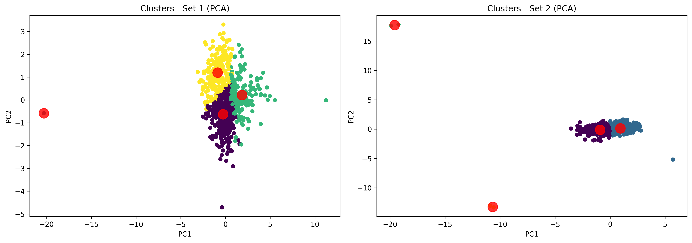

# Machine Learning Case Study: Clustering Higher Education Institutions

# Summary

Clustering analysis of higher education institutions using machine learning techniques.

Applied exploratory data analysis (EDA), preprocessing, and K-Means clustering to identify structural patterns in academic and financial data.

Key insight: academic profile variables showed stronger association with outcomes than financial factors.

This project applies unsupervised machine learning to cluster institutions and understand how their characteristics relate to academic outcomes such as graduation rates.

---

# Context

This project was developed as part of the course:

**Machine Learning: A Practical Approach with Theoretical Foundations**  
Faculty of Sciences - University of Porto (FCUP)

---

# Project Overview

Higher education institutions differ widely in terms of student composition, faculty qualifications, financial resources, and academic outcomes.

The objective of this analysis is to explore these differences and identify **structural institutional profiles** using clustering techniques.

By combining exploratory data analysis with unsupervised machine learning, the project aims to uncover patterns that may help explain variations in academic performance.

---

# Project Objectives

The main objectives of the analysis were:

- Explore structural characteristics of higher education institutions
- Identify meaningful institutional segments using clustering techniques
- Investigate how institutional profiles relate to academic success

---

# Dataset

The dataset (`volis_dataset.csv`) contains institutional information for a set of higher education institutions, including variables related to:

## Dataset Variables

| Variable | Description |
|--------|-------------|
| nm_college | Name / identifier of the institution |
| bl_private | Type of institution (private / public) |
| qt_applications_received | Number of applications received |
| qt_applications_accepted | Number of applications accepted |
| qt_students_enrolled | Number of confirmed enrollments |
| qt_top_10_percent | Percentage of new students from the top 10% of their high school class |
| qt_top_25_percent | Percentage of new students from the top 25% of their high school class |
| qt_undergraduate_students | Number of undergraduate students |
| qt_postgraduate_students | Number of postgraduate students |
| vl_tuition_outstate | Tuition fees (out-of-state) |
| vl_room_board | Cost of accommodation and meals |
| vl_books_cost | Cost of books |
| vl_personal_expenses | Personal expenses |
| pc_faculty_with_phd | Percentage of faculty with a PhD |
| pc_faculty_with_terminal_degree | Percentage of faculty with a terminal degree (highest academic degree in their field) |
| vl_student_faculty_ratio | Student-faculty ratio (average number of students per faculty member) |
| pc_alumni_donors | Percentage of alumni donors |
| vl_expenditure_per_student | Institutional expenditure per student |
| pc_graduation_rate | Graduation rate |

---

# Methodology

The analysis follows a typical machine learning workflow.

## 1. Exploratory Data Analysis (EDA)

The dataset was first explored to understand its structure and identify potential issues.

Key steps included:

- descriptive statistics
- distribution analysis
- boxplots and scatter plots
- identification of missing values
- detection of potential outliers

The analysis also explored relationships between institutional characteristics and graduation rates.

## 2. Data Preprocessing

Several preprocessing steps were applied before performing clustering:

- removal of logically inconsistent values (e.g., percentages above 100%)
- removal of extreme outliers that could distort clustering
- imputation of missing values using **median imputation**
- logarithmic transformation of highly skewed variables
- feature scaling using **RobustScaler**

These steps ensure that variables with different scales do not disproportionately influence the clustering algorithms.

## 3. Feature Selection

To capture different institutional perspectives, clustering was performed using two distinct feature sets.

### Feature Set 1 - Structural Academic Characteristics

This set focuses on institutional structure and academic capacity:

- number of undergraduate students
- expenditure per student
- percentage of top 25% students
- percentage of faculty with PhD
- student-faculty ratio

### Feature Set 2 - Financial and Performance Indicators

This set emphasizes financial and outcome-related variables:

- tuition levels
- graduation rate
- alumni donation rate
- number of applications received
- room and board costs

Using two feature sets allows the analysis to test whether institutions cluster differently depending on the perspective considered.

## 4. Clustering

The main machine learning task selected for this project was **clustering**.

### K-Means Clustering

K-Means was applied to identify groups of institutions with similar structural characteristics.

The optimal number of clusters was determined using the **Elbow Method**, which suggested **k = 4 clusters** for both feature sets.

Cluster quality was evaluated using:

- Silhouette Score
- Calinski-Harabasz Index
- Davies-Bouldin Index

Clusters were visualized using **Principal Component Analysis (PCA)** to provide a two-dimensional representation of the segmentation.

## 5. Robustness Check

To verify the stability of the segmentation, clustering was also performed using:

**Agglomerative Hierarchical Clustering**

The results showed similar overall structures, suggesting that the identified segmentation is not strongly dependent on the specific clustering algorithm used.

---

# Key Insights

The analysis revealed several important patterns:

- Academic selectivity and faculty qualifications appear strongly associated with higher graduation rates.
- Institutions with stronger academic profiles tend to show better student outcomes.
- Financial expenditure alone does not appear to fully explain academic performance.
- Clustering results suggest that institutional characteristics vary along continuous gradients rather than forming sharply separated groups.

---

## Cluster Visualization

The figure below shows the PCA projection of the institutional clusters identified by the K-Means algorithm.

## Technologies

- Python
- Pandas
- Scikit-learn
- NumPy
- Matplotlib / Seaborn
